# Frugal Onboarding

Welcome to the Frugal onboarding repository! This repository contains scripts and documentation to help you connect your cloud infrastructure to Frugal for cost monitoring and analysis.

## Overview

Frugal is a cloud cost monitoring and optimization platform that provides insights into your cloud spending across multiple providers. Our onboarding scripts automate the process of setting up secure, read-only access to your cloud accounts.

## Architecture

The following diagram shows how Frugal connects to various platforms with **read-only access** to collect cost, usage, and operational data:

```mermaid
graph TB
    F[Frugal Code<br/>Read-Only Access]

    subgraph cloud[☁️ Cloud Providers]
        GCP[🔵 Google Cloud Platform]
        AWS[🟠 Amazon Web Services]
    end

    subgraph obs[📊 Observability Platforms]
        DD[🟣 Datadog]
        NR[🟢 New Relic]
    end

    subgraph devops[🔧 Source Control]
        GL[🔴 GitLab]
        GH[⚫ GitHub]
    end

    F --> cloud
    F --> obs
    F --> devops

    style F fill:#4A90E2,stroke:#2E5C8A,stroke-width:3px,color:#fff
    style cloud fill:#E8F4F8,stroke:#4A90E2,stroke-width:2px
    style obs fill:#F0E8F8,stroke:#632CA6,stroke-width:2px
    style devops fill:#FFF4E6,stroke:#FF9900,stroke-width:2px
```



### Integration Summary

| Service | Authentication Method | Data Collected (Read-Only) |
|---------|----------------------|-----------------------------|
| 🔵 **Google Cloud Platform** | Service Account Impersonation | Billing Data, Logs, Metrics, Configuration |
| 🟠 **Amazon Web Services** | Workload Identity Federation | Billing Data, Logs, Metrics, Configuration |
| 🟣 **Datadog** | API + Application Keys | Billing Data, Logs, Metrics, Configuration |
| 🟢 **New Relic** | User API Key | Billing Data, Logs, Metrics, Configuration |
| 🔴 **GitLab** | Personal Access Token | Repository Data, CI/CD Pipelines |
| ⚫ **GitHub** | Personal Access Token | Repository Data, Actions Workflows |

## Supported Cloud Providers

### 🔵 Google Cloud Platform (GCP)
Located in `gcp/` directory

- **Script**: `frugal-gcp-setup.sh`
- **Features**:
  - Service account creation with read-only permissions
  - Service account impersonation (recommended)
  - Multi-project support for organization-wide monitoring
  - Access to billing data, metrics, logs, and resource metadata
  - Vertex AI and AI Platform access
  - Automatic BigQuery billing export detection across all projects
  - Custom storage metadata role for secure bucket listing

[View GCP Setup Guide →](gcp/README.md)

### 🟠 Amazon Web Services (AWS)
Located in `aws/` directory

- **Script**: `frugal-aws-setup.sh`
- **Features**:
  - IAM role creation for Workload Identity Federation (recommended)
  - **Multi-account support via AWS Organizations** with auto-discovery
  - Organization-wide monitoring (`--org-accounts all`)
  - Filtered account discovery (by name pattern, OU, or status)
  - Selective account monitoring (`--additional-accounts`)
  - AssumeRole-based cross-account access (no manual profile configuration)
  - IAM user with access keys (alternative option, now supports multi-account)
  - ViewOnlyAccess policy for comprehensive read permissions
  - Custom Cost Explorer policy for billing data access
  - Secure cross-cloud authentication from GCP

[View AWS Setup Guide →](aws/README.md)

### 🟢 New Relic
Located in `newrelic/` directory

- **Script**: `frugal-newrelic-setup.sh`
- **Features**:
  - API key validation and testing
  - Account access verification
  - Data source detection (APM, Infrastructure, Synthetics)
  - Secure credential storage
  - Guided setup process for creating dedicated users

[View New Relic Setup Guide →](newrelic/README.md)

### 🟣 Datadog
Located in `datadog/` directory

- **Script**: `frugal-datadog-setup.sh`
- **Features**:
  - Service account-based authentication with API and Application Keys
  - Custom role creation with minimal read-only permissions
  - Comprehensive API endpoint testing and validation
  - Data source detection (Metrics, Monitors, Logs, Usage)
  - Secure credential storage and management

[View Datadog Setup Guide →](datadog/README.md)

### 🔴 GitLab
Located in `gitlab/` directory

- **Script**: `frugal-gitlab-setup.sh`
- **Features**:
  - Personal Access Token setup with read-only permissions
  - Access to repository files and commit history
  - View issues, merge requests, and CI/CD pipelines
  - Support for both GitLab.com and self-hosted instances
  - Secure credential storage and token validation

[View GitLab Setup Guide →](gitlab/README.md)

## Quick Start

### For GCP Users
```bash
cd gcp
./frugal-gcp-setup.sh <service-account-name> <project-id> --impersonate <frugal-service-account>
```

For multi-project setup:
```bash
cd gcp
./frugal-gcp-setup.sh <service-account-name> <project-id> \
  --impersonate <frugal-service-account> \
  --additional-projects "project-2,project-3"
```

### For AWS Users

> **💡 Multi-Account Cost Visibility**: For organization-wide cost data, run the script from your **AWS Organizations management account**. Member accounts can only see their own costs.

**Single account:**
```bash
cd aws
./frugal-aws-setup.sh <role-name> <account-id> --wif <gcp-service-account>:<project-number>
```

**Multi-account (organization-wide):**
```bash
cd aws
./frugal-aws-setup.sh <role-name> <account-id> \
  --wif <gcp-service-account>:<project-number> \
  --org-accounts all
```

**Multi-account (selective):**
```bash
cd aws
./frugal-aws-setup.sh <role-name> <account-id> \
  --wif <gcp-service-account>:<project-number> \
  --additional-accounts "111111111111,222222222222,333333333333"
```

**Multi-account (filtered by pattern):**
```bash
cd aws
./frugal-aws-setup.sh <role-name> <account-id> \
  --wif <gcp-service-account>:<project-number> \
  --org-accounts 'Name=*-prod*'
```

### For New Relic Users
```bash
cd newrelic
./frugal-newrelic-setup.sh <account-id>
```

### For Datadog Users
```bash
cd datadog
./frugal-datadog-setup.sh
```

### For GitLab Users
```bash
cd gitlab
./frugal-gitlab-setup.sh <username-or-group>
```

## Security Model

All our onboarding scripts follow security best practices:

- **Read-only access**: No ability to modify your infrastructure
- **Least privilege**: Only permissions necessary for cost monitoring
- **No long-lived credentials**: Preference for token-based authentication
- **Transparent operations**: Scripts show all changes before applying them
- **Easy removal**: `--undo` flag to cleanly remove all created resources

## Authentication Architecture

### GCP → GCP Access
- Uses service account impersonation
- Frugal's GCP service account impersonates your service account
- No keys exchanged

### GCP → AWS Access
- Uses Workload Identity Federation
- AWS trusts Google's OIDC provider
- Frugal's GCP service account assumes AWS IAM role
- No AWS credentials stored

### GCP → New Relic Access
- API key-based authentication
- Keys stored securely in GCP Secret Manager
- Regular key rotation supported
- User-based permissions model

### GCP → Datadog Access
- Service account-based API key authentication
- API Key and Application Key pair for secure access
- Custom roles with least privilege permissions
- Keys stored securely with restricted file permissions

## Prerequisites

### For GCP Setup
- `gcloud` CLI installed and authenticated (`gcloud auth login`)
- IAM permissions in target project(s):
  - `roles/iam.serviceAccountAdmin` (create service accounts)
  - `roles/iam.roleAdmin` (create custom roles)
  - `roles/resourcemanager.projectIamAdmin` (grant IAM roles)
  - OR `roles/owner` (includes all required permissions)
- Active GCP project with billing enabled
- For multi-project setup: same permissions in each additional project

### For AWS Setup
- `aws` CLI installed and configured
- `jq` command-line JSON processor installed
- IAM permissions to create roles/users and attach policies
- Valid AWS account ID
- **For multi-account setups**: Access to the AWS Organizations management account (for consolidated billing/cost visibility)

### For New Relic Setup
- Active New Relic account
- Account administrator access (to create users)
- New Relic account ID

### For Datadog Setup
- Active Datadog account
- Admin permissions to create service accounts and roles
- Access to Settings → Access Management

### For GitLab Setup
- Active GitLab account (GitLab.com or self-hosted)
- Permissions to create Personal Access Tokens
- Access to the repositories/projects you want to monitor
- `curl` and optionally `jq` installed

## Support

If you encounter any issues during onboarding:

1. Check the detailed README in each provider's directory
2. Review the script output for specific error messages
3. Ensure you have the necessary permissions in your cloud account
4. Contact Frugal support with any error messages

## Contributing

This repository is maintained by Frugal. If you find issues or have suggestions for improvements, please open an issue or submit a pull request.

## License

These onboarding scripts are provided under the MIT License to facilitate integration with Frugal's platform. See the [LICENSE](LICENSE) file for full details.